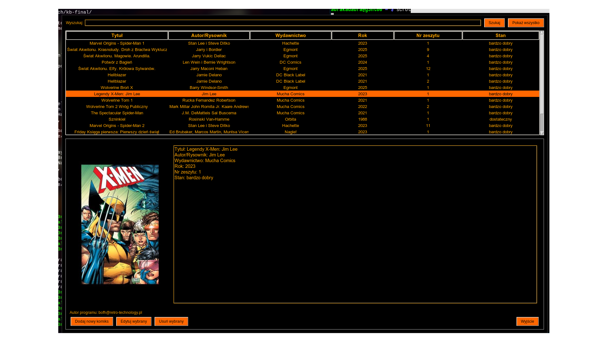

# Instrukcja uruchomienia programu

---

## 1. Wymagania systemowe i Pythona

- **Python** – Twój program wymaga interpretera Python (zakładam wersję 3.x).  
- Sprawdź wersję Pythona poleceniem:
  ```bash
  python3 --version
  ```
- Jeśli nie masz Pythona, zainstaluj go (np. na Ubuntu/Debian):
  ```bash
  sudo apt update
  sudo apt install python3 python3-pip
  ```

---

## 2. Zależności programowe (biblioteki Pythona)

- Jeśli w Twoim folderze projektu (`/home/user/bazadanych/kb-final/`) znajduje się plik `requirements.txt`, możesz zainstalować potrzebne biblioteki poleceniem:
  ```bash
  pip3 install -r /home/user/bazadanych/kb-final/requirements.txt
  ```

- Jeśli nie masz takiego pliku, a znasz biblioteki użyte w programie, zainstaluj je ręcznie, np.:
  ```bash
  pip3 install numpy pandas requests flask
  ```
  oczywiście zamieniając na właściwe nazwy.

- Aby sprawdzić, jakich bibliotek używa Twój skrypt, możesz odczytać pierwszą część pliku `kb-final.py` i szukać linii z `import` lub `from`.

---

## 3. Wirtualne środowisko (opcjonalnie, ale zalecane)

Zaleca się utworzenie wirtualnego środowiska aby nie mieszać bibliotek z globalnie zainstalowanym Pythonem.

```bash
cd /home/user/bazadanych/kb-final/
python3 -m venv venv
source venv/bin/activate
pip install -r requirements.txt  # jeśli jest taki plik
```

---

## Plik `comics_db.json`

Do działania programu potrzebny jest plik `comics_db.json`.

Przykładowa zawartość:

```json
[
    {
        "title": "Marvel Origins - Spider-Man 1",
        "author": "Stan Lee i Steve Ditko",
        "publisher": "Hachette",
        "year": "2023",
        "issue": "1",
        "condition": "bardzo dobry",
        "cover": "/home/user/covers/sp1.png"
    },
    {
        "title": "Friday Księga trzecia:  Znów mamy święta",
        "author": "Ed Brubaker, Marcos Martin, Muntsa Vicente",
        "publisher": "Nagle!",
        "year": "2024",
        "issue": "3",
        "condition": "bardzo dobry",
        "cover": "/home/user/covers/f3.jpg"
    }
]
```

---
